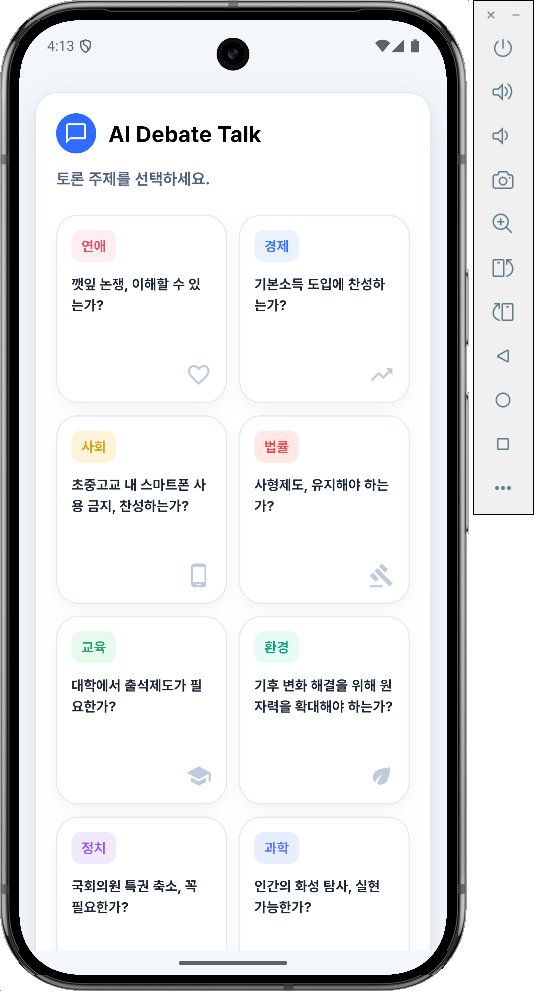
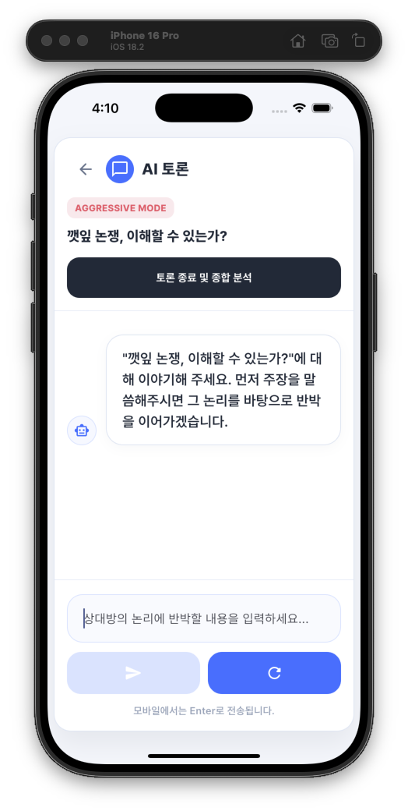
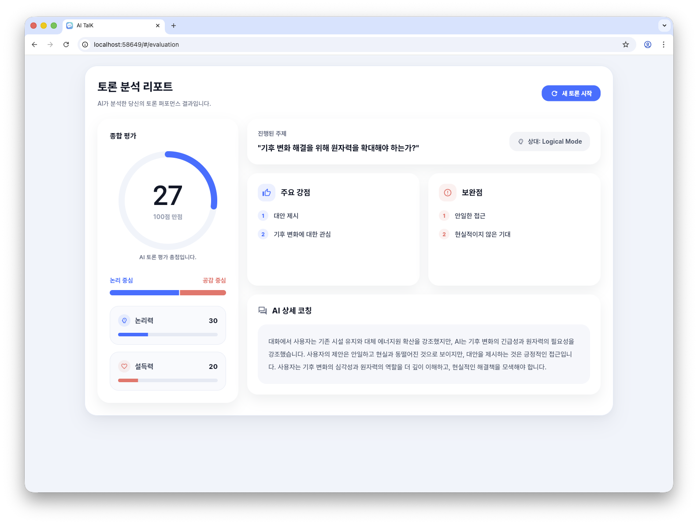

# AI Debate App

<p align="center">
  <b>AI 기반 실전 토론 훈련 앱</b><br/>
  주제 선택부터 실시간 토론, 결과 분석 리포트까지 하나의 흐름으로 설계한 Flutter 애플리케이션
</p>

<p align="center">
  
  
  
  
  
</p>

<br/>

<table>
  <tr>
    <td align="center" width="50%">
      <br/>
      <b>Topic Selection</b><br/>
      주제 탐색과 토론 스타일 설정
    </td>
    <td align="center" width="50%">
      <br/>
      <b>Real-time Debate</b><br/>
      AI와 실시간 찬반 토론
    </td>
  </tr>
  <tr>
    <td colspan="2" align="center">
      <br/>
      <b>Evaluation Report</b><br/>
      논리성, 설득력, 강점, 보완점을 구조적으로 제공
    </td>
  </tr>
</table>

---

## Overview

AI Debate App은 사용자가 논리적 사고와 반박 능력을 반복적으로 훈련할 수 있도록 설계한 AI 토론 애플리케이션입니다.  
단순한 챗봇 경험이 아니라 `주제 선택 → 토론 진행 → 결과 분석`으로 이어지는 학습형 사용자 흐름을 제품 수준으로 구현하는 데 집중했습니다.

Flutter 기반으로 구현해 **Android, iOS, Web**에서 동일한 핵심 경험을 제공할 수 있도록 구성했습니다.

## Problem

기존의 토론 연습은 아래 한계가 있습니다.

- 실생활에서 논리적 사고를 반복 훈련할 수 있는 실전형 도구가 부족함
- 온라인 토론은 감정 소모가 커 생산적인 연습으로 이어지기 어려움
- 이론 학습만으로는 실제 반박과 논리 전개를 빠르게 익히기 어려움

## Solution

이 문제를 해결하기 위해 아래 흐름으로 서비스를 설계했습니다.

- 사용자가 주제를 선택하거나 직접 입력
- 토론 스타일을 선택해 AI 상대의 성향 조정
- 실시간 대화로 주장과 반박을 반복 훈련
- 토론 종료 후 점수와 피드백 리포트 제공

AI 상대는 `Aggressive`, `Logical`, `Kind` 스타일로 나뉘며, 사용 목적에 따라 다른 토론 경험을 제공하도록 구성했습니다.

## Platform Support

| Platform | Support |
| --- | --- |
| Android | 모바일 터치 인터랙션과 채팅 UX 중심 지원 |
| iOS | 한글 입력 조합과 레이아웃 안정성을 고려한 사용 경험 지원 |
| Web | 넓은 화면에서 평가 리포트와 토론 흐름을 보기 쉽게 제공 |

## Core Features

- 추천 주제 선택 및 직접 주제 입력
- 토론 스타일 선택 기반 세션 시작
- AI와의 실시간 찬반 토론 채팅
- 세션 초기화, 로딩, 실패 상태를 포함한 안정적인 상호작용
- 점수, 요약, 강점, 보완점을 포함한 평가 리포트 제공
- Android, iOS, Web을 고려한 반응형 레이아웃

## UI/UX

| Feature | Description |
| --- | --- |
| Topic Selection | 추천 주제 탐색과 직접 입력을 모두 지원해 빠르게 토론을 시작할 수 있도록 구성 |
| AI Style Setting | 공격형, 논리형, 친절형 스타일 중 선택해 난이도와 대화 톤을 조절 |
| Real-time Debate | 직관적인 채팅 UI에서 AI와 실시간으로 논리를 주고받는 구조 |
| Evaluation Report | 논증 구조, 근거 타당성, 설득력, 약점을 결과 리포트로 제공 |

## Tech Stack

| Layer | Stack |
| --- | --- |
| Frontend | `Flutter`, `flutter_bloc`, `Equatable` |
| Networking | `Dio` |
| Dependency Injection | `GetIt` |
| Architecture | `Presentation - Domain - Data` |
| Target Platforms | `Android`, `iOS`, `Web` |
| Testing | `flutter_test` |

```text
lib/
├── app/
├── core/
│   ├── di/
│   └── network/
└── features/
    ├── data/
    ├── domain/
    └── presentation/
```

## Technical Highlights

| Area | Decision | Impact |
| --- | --- | --- |
| State Management | 홈, 채팅, 평가 화면마다 Bloc을 분리 | 로딩, 입력, 성공, 실패 상태가 서로 섞이지 않도록 제어 |
| Domain Design | `GetHomeItems`, `SendChatMessage`, `EvaluateDebate`, `ResetDebate`로 UseCase 분리 | 화면 코드와 비즈니스 로직 결합도 감소 |
| Session Flow | 대화마다 고유 `session_id`를 생성하고 채팅/평가 요청을 동일 세션 기준으로 처리 | 토론 문맥 유지와 세션 안정성 확보 |
| Network Handling | `DioException` 유형과 상태 코드 기준으로 오류 세분화 | 타임아웃, 인증 오류, 404, 5xx, 연결 실패를 구분해 사용자 메시지 제공 |
| Cross-platform UI | 화면 크기에 따라 패딩, 컨테이너 폭, 레이아웃 밀도 조정 | Android, iOS, Web에서 모두 자연스럽게 읽히는 UI 구성 |
| Data Validation | 평가 결과 표시 전 최소 필수 데이터 충족 여부 검증 | 불완전한 응답이 결과 화면에 그대로 노출되지 않도록 방지 |

## Troubleshooting

| Issue | Approach | Result |
| --- | --- | --- |
| AI 응답 속도와 체감 성능 저하 | 요청 타임아웃 기준을 분리하고 실패 원인을 유형별로 구분 | 사용자가 현재 상태를 빠르게 인지할 수 있도록 개선 |
| 자동 스크롤로 인한 읽기 흐름 단절 | 스크롤 위치가 하단 근처일 때만 자동 스크롤 동작 | 실시간성과 가독성을 함께 확보 |
| 모바일 한글 입력 조합 이슈 | 입력값의 composing 상태를 확인한 뒤 조합 종료 후 submit 실행 | 의도하지 않은 불완전 메시지 전송 방지 |
| 불완전한 평가 응답 노출 문제 | 응답 성공 여부와 별도로 표시 가능 데이터인지 검증 | 결과 화면 품질과 신뢰도 유지 |

## Testing

핵심 대화 흐름의 안정성을 위해 `ChatBloc` 중심의 상태 전이 테스트를 작성했습니다.

- 시작 시 환영 메시지 노출
- 메시지 전송 성공 시 사용자 메시지와 AI 응답 순서 보장
- 메시지 전송 실패 시 사용자 메시지 유지 및 오류 상태 반영
- 타임아웃 발생 시 사용자 안내 문구 노출

## Roadmap

- 토론 기록 저장 및 다시 보기 기능
- 사용자별 토론 성향 분석 리포트 고도화
- 주제 추천 개인화
- Bloc 및 화면 단위 테스트 범위 확대
- 교육용 확장 시나리오 검토

## Running Locally

```bash
flutter pub get
flutter run
```
